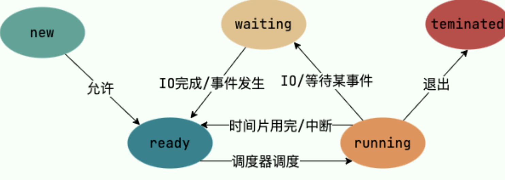
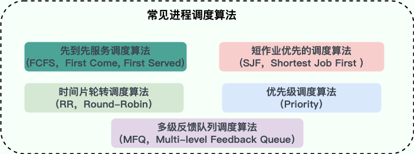
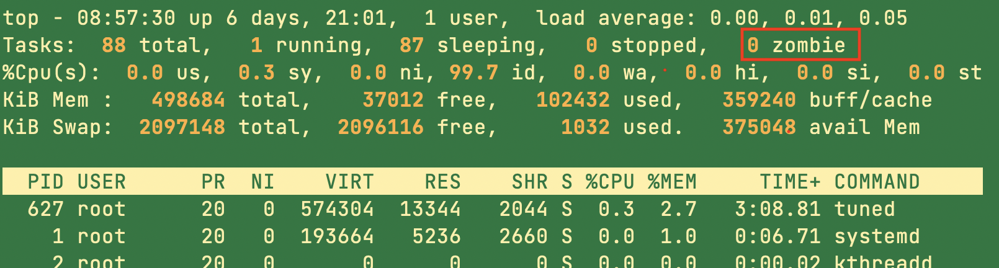

# 进程和线程

## 什么是进程和线程？

- 进程是操作系统中运行的一个程序实例。
- 线程是更轻量级的线程，一个进程中可以包含多个线程。

同一个进程内的多个线程之间可以共享一些信息如虚拟地址表、文件句柄和网络连接。

## 进程和线程的区别是什么？

- 进程是资源分配的基本单位，线程是任务调度的基本单位。
- 进程切换的开销很大，而线程切换的开销比较小。
- 进程之间通讯比较麻烦。而线程因为有内存共享的区域，所以比较方便。但也因为这样，进程的信息更安全，而线程之间的数据极有可能相互影响。

## 为什么有了进程还需要线程？

- 线程切换开销小
- 线程间的通信比较方便，但需要注意多线程的并发安全问题
- 线程更轻量级，一个进程可以创建多个线程，并使用相同的共享资源

## 为什么要使用多线程？

- 线程的创建和切换的开销比较小。
- 现代的系统有百万千万级别的并发量。而多线程是解决高并发问题的基础。
- 在CPU越来越多核的如今，使用多线程可以提高CPU的利用率。

## 线程间的同步方式有哪些？

1. **互斥锁（mutex）**：互斥对象机制保证同一时间只有一个线程访问资源，保证了资源的安全问题。如Java中的synchronized对象。
2. **读写锁**：允许多个线程读取共享资源，但只有一个线程能对资源进行写操作。
3. **信号量（semaphore）**：可以控制资源的最大线程访问量
4. **屏障（Barrier）**：屏障是一个同步原语，用于等待多个线程达到某一个屏障点。但一个线程到达屏障时，它会阻塞等待其他线程的到来，当所有线程到达屏障点后，屏障就会打开。Java中CyclicBarrier使用的就是屏障机制。
5. **Event（Wait/Notify）**：通过通知的方式保持线程的同步。

## PCB是什么？包含哪些信息？

PCB为进程控制块，是Process Control Block的缩写，是操作系统用于管理和控制进程的数据结构。每个进程都在操作系统中对应着一个PCB。当一个进程创建的时候，操作系统会为其分配一个唯一的id并为其分配一个对应的PCB。当程序运行的时候，PCB中的内容会不断变化，操作系统会根据PCB的内容管理和调度进程。

PCB包含以下几部分的内容：

- 进程的描述信息：进程的名称和标识符等等
- 进程的调度信息：进程阻塞原因、进程状态、进程优先级等等
- 进程对资源的需求信息：CPU时间、内存空间、IO设备等等
- 进程打开的文件信息：文件描述符、文件类型、打开模式等等
- 处理机的状态信息：通用寄存器、指令计数器、程序状态字、用户栈指针

## 进程的状态

进程包括以下几种状态，和线程的很像：

- **创建（new）**：进程刚被创建，资源分配还没完成
- **就绪（ready）**：进程以及获取了除CPU之外的所有资源，处于就绪队列，随时可以进入运行状态
- **运行（running）**：进程正在CPU上运行
- **阻塞（waiting）**：进程因为等待某个资源或者IO操作进入等待状态，此时进程不能运行
- **结束（terminated）**：进程已经结束运行，正在从系统中退出

## 进程间的通信方式

进程间的通信包括以下几种方式：

1. **匿名管道**：管道的通信是单向的，因为没有名字，所以用于具有亲缘关系的进程之间的通信。如`ls -all | grep jiquan`操作，第二个grep操作使用fork创建一个子进程，｜创建一个管道。
2. **管道**：由于匿名管道无法在无亲缘关系的进程间通信，所以需要有名管道。管道以磁盘文件的形式存在，可实现任意两个进程之间的通信。管道的消息都是基于字节流的。
3. **消息队列**：管道都是单向的，有时候需要消息队列这种双向的通信方式。消息队列以数据块的形式存放数据。消息队列支持消息的随机读取，不一定非要按照FIFO的形式读取消息。但由于以消息块的形式存放信息，所以消息队列一次存放的数据是有大小限制的，无法传输大文件
4. **Socket套接字**：支持不同主机上的线程进行通信，支持TCP/IP网络传输，处于应用层和传输层，向上提供网络服务，屏蔽了传输层协议的复杂机制。如果在同一主机，可以使用本地套接字。
5. **信号**：比较复杂的通信方式，Kernel会向进程发送一个信号，进程收到此信号后会根据信号类型作出相应的处理行为。`kill -l`可查看所有的信号类型。
6. **共享内存**：多个进程可以访问同一块内存区域。不同的进程也可以看到对方对共享区域的更新操作。但这种方式需要一定的机制保护并发安全。比如互斥锁和读写锁等。算得上是最有用的通信方式
7. **信号量**：本质上就是一个整数计数器，用于同步进程。信号量使用一个整数表示“资源的剩余数量”，使用wait（P操作）进行信号减一，如果减完后大雨等于零，表示资源可用。使用signal（V操作）进行信号加一，如果加完后信号小于等于零，表示有其他进程在等待此资源，需要唤醒他们。

## 进程的调度算法

进程的调度需要由操作系统决定，而操作系统又是根据调度算法决定下一个线程：

1. **先来先服务算法（FCFS，First Come First Serve）**：从就绪队列中选择一个最先进入该队列的进程为之分配资源，使它立即执行并一直执行到完成或发生某事件而被阻塞放弃占用 CPU 时再重新调度。
2. **短作业优先的调度算法(SJF，Shortest Job First)** : 从就绪队列中选出一个估计运行时间最短的进程为之分配资源，使它立即执行并一直执行到完成或发生某事件而被阻塞放弃占用 CPU 时再重新调度。
3. **时间片轮转调度算法（RR，Round-Robin）** : 时间片轮转调度是一种最古老，最简单，最公平且使用最广的算法。每个进程被分配一个时间段，称作它的时间片，即该进程允许运行的时间。
4. **多级反馈队列调度算法（MFQ，Multi-level Feedback Queue）**：前面介绍的几种进程调度的算法都有一定的局限性。如**短进程优先的调度算法，仅照顾了短进程而忽略了长进程** 。多级反馈队列调度算法既能使高优先级的作业得到响应又能使短作业（进程）迅速完成。，因而它是目前**被公认的一种较好的进程调度算法**，UNIX 操作系统采取的便是这种调度算法。
5. **优先级调度算法（Priority）**：为每个流程分配优先级，首先执行具有最高优先级的进程，依此类推。具有相同优先级的进程以 FCFS 方式执行。可以根据内存要求，时间要求或任何其他资源要求来确定优先级。

## 僵尸进程和孤儿进程

在Unix/Linux中，子进程通常是父进程调用fork创建的，子进程是父进程的一个副本，他们运行是相互独立的，拥有各自的PCB，即便父进程结束了，子进程也可以继续运行。

当一个进程调用exit退出系统的时候，内核会释放进程的所有资源，但其对应的PCB仍然在内存中。这些资源需要父进程调用wait或者waitpid系统调用才能释放。这样的设计可以让父进程在子进程结束的时候，知道其状态信息。

- **僵尸进程**：子进程已经退出结束，父进程仍然在运行，但父进程没有调用wait和waitpid释放PCB占用的资源。这种情况下，子进程仍存在于操作系统中，但无法被进一步使用。
- **孤儿进程**：父进程已经退出或因为意外退出，导致没有调用wait和waitpid方法回收子进程。此时子进程就成了孤儿进程。为了回收孤儿进程，操作系统会把其父进程设置为init进程（pid为1），由init进程回收孤儿进程。

## 如何查看孤儿进程？

`top`命令可以实时观测进程状态，zombie数字表示的就是僵尸进程的数量。

